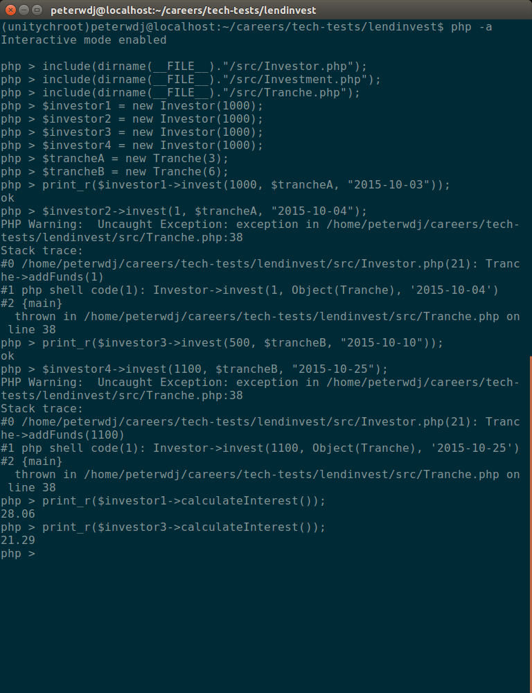

# LendInvest Tech Test

[Introduction](#introduction) | [Quickstart](#quickstart) | [Approach](#approach) | [Challenges](#challenges) | [Miscellaneous Notes](#miscellaneous-notes)

## Introduction

This is a tech test for [LendInvest](https://www.lendinvest.com/), As per the brief, it is written in PHP, with no external libraries except [Composer](https://getcomposer.org/) and [PHPUnit](https://phpunit.de/), without the use of a database.

The specification for the project is, given a loan beginning 01/10/2015 and ending 15/11/2015:
  - The loan has 2 tranches, A and B, ( at 3% and 6% monthly interest rate respectively).
  - Each tranche has 1,000 pounds available.
  - There are four investors, each with 1,000 pounds in his or her virtual wallet.
    - As “Investor 1” I’d like to invest 1,000 pounds on the tranche “A” on 03/10/2015: “ok”.
    - As “Investor 2” I’d like to invest 1 pound on the tranche “A” on 04/10/2015: “exception”.
    - As “Investor 3” I’d like to invest 500 pounds on the tranche “B” on 10/10/2015: “ok”.
    - As “Investor 4” I’d like to invest 1,100 pounds on the tranche “B” 25/10/2015: “exception”.
  - On 01/11/2015 the system runs the interest calculation for the period 01/10/2015 -> 31/10/2015:
    - “Investor 1” earns 28.06 pounds
    - “Investor 3” earns 21.29 pounds

  The image below shows a working, command-line implementation of a solution to this specification.

  


## Quickstart

This application is designed to be run in the command line. You will need to have both [PHP](http://www.php.net/) 7, [Composer](https://getcomposer.org/), and, to run the tests, [PHPUnit](https://phpunit.de/) installed first.

To get started, clone this repository, and install project dependencies using Composer:

```
$ php composer.phar install
```

You will then be able to open the interactive PHP shell to use the application:

```
$ php -a
```

You can satisfy the requirements of the specification as follows.

Requiring the necessary classes:

```
php > include(dirname(__FILE__)."/src/Investor.php");      
php > include(dirname(__FILE__)."/src/Investment.php");
php > include(dirname(__FILE__)."/src/Tranche.php");
```
Initialises the necessary objects:
```

php > $investor1 = new Investor(1000);         
php > $investor2 = new Investor(1000);
php > $investor3 = new Investor(1000);
php > $investor4 = new Investor(1000);

// investors are initialised with a number of pounds, expressed as an integer

php > $trancheA = new Tranche(3);
php > $trancheB = new Tranche(6);

// tranches are initialised with an interest rate, expressed as an integer
```

(Attempting to) invest in tranches:
N.B. to see the  return values printed out, make the entire call as an argument in PHP's `print_r()` [method](http://php.net/manual/en/function.print-r.php).
```

php > $investor1->invest(1000, $trancheA, "2015-10-03");       ## returns "ok"
php > $investor2->invest(1000, $trancheA, "2015-10-04");       ## raises an Exception as the tranche is full
php > $investor3->invest(500, $trancheB, "2015-10-10");        ## returns "ok"
php > $investor4->invest(1100, $trancheB, "2015-10-25");       ## raises an Exception as the tranche is full


// the invest method takes three arguments:
// - an amount to invest, expressed as an integer
// - the tranche into which the money is being invested, an instance of the Tranche object
// - the date of the investment, expressed as a string
```
Returning the accrued interest:   
(See earlier note on using `print_r()` to return values.)
```
php > $investor1->calculateInterest();                         ## returns 28.06
php > $investor3->calculateInterest();                         ## returns 21.29
```

Tests are run using PHPUnit:
```
./vendor/bin/phpunit --bootstrap vendor/autoload.php tests                   ## runs the entire test suite
./vendor/bin/phpunit --bootstrap vendor/autoload.php tests/testFile.php      ## runs an individual test
```
Each can be run with the `--testdox` option preceding the files passed in to display the test results in a prettier, more human-readable format. 


## Approach


## Challenges


## Limitations
